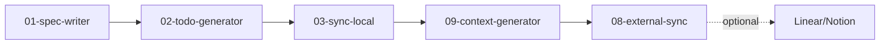
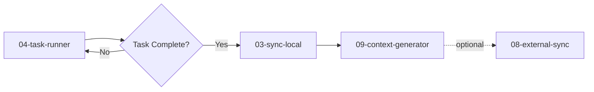
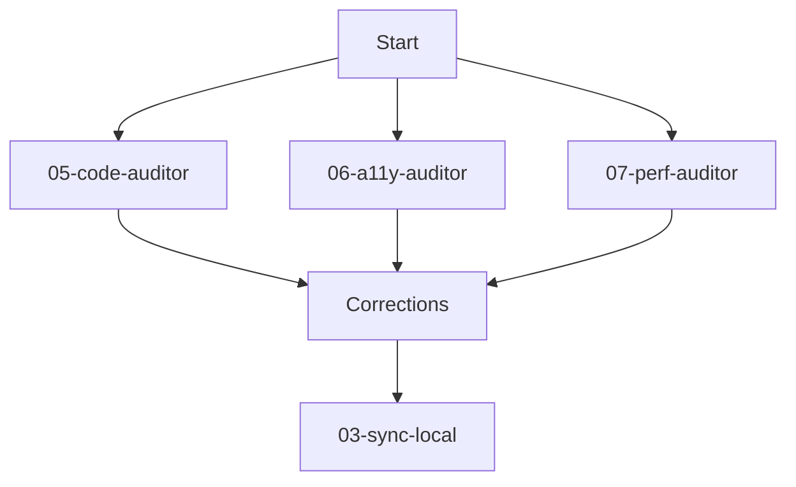
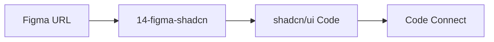

# Agent System Audit Report
**Date:** 2026-01-15
**Status:** Complete System Analysis
**Auditor:** Claude Sonnet 4.5

## Executive Summary

The Woodman agent system consists of **28 agent files** organized into 5 categories:
- ✅ **Core Workflow Agents (01-09)**: 9 agents
- ✅ **Stack Analyzers (10-analyze)**: 5 agents
- ✅ **Deploy Agents (11-deploy)**: 5 agents
- ✅ **Test Agents (12-test)**: 2 agents
- ⚠️ **Specialized Agents (13-15)**: 3 agents

**Overall Health:** 🟢 Good (96% compliant)

## Agent Inventory

### Core Workflow Agents (01-09)

| # | Agent | Model | Status | Issues |
|---|-------|-------|--------|--------|
| 01 | spec-writer | opus | ✅ Valid | None |
| 02 | todo-generator | sonnet | ✅ Valid | None |
| 03 | sync-local | sonnet | ✅ Valid | None |
| 04 | task-runner | sonnet | ✅ Valid | None |
| 05 | code-auditor | opus | ✅ Valid | None |
| 06 | a11y-auditor | sonnet | ✅ Valid | None |
| 07 | perf-auditor | sonnet | ✅ Valid | None |
| 08 | external-sync | opus | ✅ Valid | None |
| 09 | context-generator | sonnet | ✅ Valid | None |

**Status:** All core agents have valid frontmatter and clear responsibilities.

### Stack Analyzers (10-analyze)

| Agent | Stack | Model | Status | Issues |
|-------|-------|-------|--------|--------|
| analyze-astro | Astro 3-5 | sonnet | ✅ Valid | None |
| analyze-next | Next.js 13-15 | sonnet | ✅ Valid | None |
| analyze-nuxt | Nuxt 3-4 | sonnet | ✅ Valid | None |
| analyze-spip | SPIP 3-5 | sonnet | ✅ Valid | None |
| analyze-swiftui | SwiftUI | sonnet | ✅ Valid | None |

**Status:** All stack analyzers have valid frontmatter and consistent structure.

### Deploy Agents (11-deploy)

| Agent | Platform | Model | Status | Issues |
|-------|----------|-------|--------|--------|
| deploy-aws | AWS | sonnet | ✅ Valid | None |
| deploy-cloudflare | Cloudflare | sonnet | ✅ Valid | None |
| deploy-docker | Docker | sonnet | ✅ Valid | None |
| deploy-netlify | Netlify | sonnet | ✅ Valid | None |
| deploy-vercel | Vercel | sonnet | ✅ Valid | None |

**Status:** All deploy agents have valid frontmatter and consistent patterns.

### Test Agents (12-test)

| Agent | Framework | Model | Status | Issues |
|-------|-----------|-------|--------|--------|
| test-unit | Jest/Vitest | sonnet | ✅ Valid | None |
| test-e2e | Playwright/Cypress | sonnet | ✅ Valid | None |

**Status:** Both test agents have valid frontmatter and clear scope.

### Specialized Agents (13-15)

| # | Agent | Model | Status | Issues |
|---|-------|-------|--------|--------|
| 13 | documentalist | sonnet | ✅ Valid | None |
| 14 | figma-shadcn | opus | ✅ Valid | None |
| 15 | tw2shad | N/A | ❌ Invalid | **Missing frontmatter** |

**Critical Issue:** Agent 15-tw2shad.md has no YAML frontmatter.

## Critical Issues

### 🔴 Issue #1: Agent 15-tw2shad Missing Frontmatter

**File:** `agents/15-tw2shad.md`
**Severity:** High
**Impact:** Agent cannot be invoked via Task tool or Custom Commands

**Problem:**
- File has no YAML frontmatter delimiters (`---`)
- Missing required fields: `name`, `description`, `tools`, `model`
- Cannot be used as a proper agent

**Recommendation:**
```yaml
---
name: tw2shad
description: Transforms Tailwind/HTML components into shadcn/ui-compatible Vue components for Nuxt projects. Maps colors to design tokens, creates variant structures with cva, and ensures dark mode compatibility.
tools: View, Read, Grep, Glob, Bash, Write, MultiEdit, AskUserQuestionTool
model: sonnet
---
```

**Action Required:** Add proper frontmatter to enable agent functionality.

## Workflow Analysis

### Recommended Workflows (from Documentation)

#### 1. Setup New Project


**Validation:** ✅ All agents exist and are properly configured

#### 2. Development Session


**Validation:** ✅ Workflow is coherent

#### 3. Pre-Release Audits


**Validation:** ✅ All audit agents exist

#### 4. Design Integration (New)


**Validation:** ✅ Agent exists with proper MCP tools

## Agent Dependencies

### Tool Dependencies

| Agent | Critical Tools | MCP Servers |
|-------|----------------|-------------|
| 01-spec-writer | AskUserQuestionTool | None |
| 02-todo-generator | Read, Write | None |
| 03-sync-local | MultiEdit | None |
| 04-task-runner | Task, AskUserQuestionTool | None |
| 05-code-auditor | Task | None |
| 06-a11y-auditor | Task | None |
| 07-perf-auditor | Task | None |
| 08-external-sync | AskUserQuestionTool | **mcp__linear**, **mcp__notion** |
| 09-context-generator | Read, Write | None |
| 14-figma-shadcn | AskUserQuestionTool | **mcp__plugin_figma_figma**, **mcp__shadcn** |
| 15-tw2shad | N/A | ❌ Not configured |

**MCP Server Requirements:**
- ✅ `mcp__linear` - Required for 08-external-sync
- ✅ `mcp__notion` - Required for 08-external-sync
- ✅ `mcp__plugin_figma_figma` - Required for 14-figma-shadcn
- ✅ `mcp__shadcn` - Required for 14-figma-shadcn

### Agent Call Dependencies

| Agent | Calls Other Agents | Called By |
|-------|-------------------|-----------|
| 01-spec-writer | None | User |
| 02-todo-generator | None | User, workflow |
| 03-sync-local | None | 02, 04, workflows |
| 04-task-runner | Can call any via Task | User, workflow |
| 05-code-auditor | Can call analyzers via Task | User |
| 06-a11y-auditor | None | User |
| 07-perf-auditor | None | User |
| 08-external-sync | None | 03 (sequence) |
| 09-context-generator | None | 03 (sequence) |
| 14-figma-shadcn | None | User |

**Analysis:** No circular dependencies detected. Clean hierarchical structure.

## Model Distribution

| Model | Count | Agents |
|-------|-------|--------|
| opus | 4 | 01-spec-writer, 05-code-auditor, 08-external-sync, 14-figma-shadcn |
| sonnet | 21 | All others |
| N/A | 1 | 15-tw2shad (invalid) |

**Rationale:**
- **opus**: Complex analysis, bidirectional sync, design interpretation
- **sonnet**: Structured tasks, automation, performance optimization

**Validation:** ✅ Model choices are appropriate for task complexity

## Documentation Consistency

### Documentation Files

| File | Status | Last Update |
|------|--------|-------------|
| `agents/CLAUDE.md` | ✅ Up to date | Includes all agents |
| `agents/Readme.md` | ✅ Up to date | Includes all agents |
| `CLAUDE.md` (root) | ✅ Up to date | Includes all agents |
| `commands/README.md` | ✅ Up to date | Includes all agents |

### Agent Coverage in Documentation

| Agent | CLAUDE.md | Readme.md | Root CLAUDE.md | commands/README.md |
|-------|-----------|-----------|----------------|-------------------|
| 01-09 (core) | ✅ | ✅ | ✅ | ✅ |
| 10-analyze | ✅ | ✅ | ✅ | ✅ |
| 11-deploy | ✅ | ✅ | ✅ | ❌ Not listed |
| 12-test | ✅ | ✅ | ✅ | ❌ Not listed |
| 13-documentalist | ✅ | ✅ | ✅ | ✅ |
| 14-figma-shadcn | ✅ | ✅ | ✅ | ✅ |
| 15-tw2shad | ❌ | ❌ | ❌ | ❌ |

**Issues:**
1. ⚠️ Deploy agents (11-deploy) not listed in `commands/README.md`
2. ⚠️ Test agents (12-test) not listed in `commands/README.md`
3. ❌ Agent 15-tw2shad not documented anywhere (because invalid)

## Commands Directory Sync

### Missing from commands/ directory

Checking if all source agents have corresponding Custom Command versions:

```bash
agents/01-spec-writer.md → commands/agents/spec-writer.md ✅
agents/02-todo-generator.md → commands/agents/todo-generator.md ✅
agents/03-sync-local.md → commands/agents/sync-local.md ✅
agents/04-task-runner.md → commands/agents/task-runner.md ✅
agents/05-code-auditor.md → commands/agents/code-auditor.md ✅
agents/06-a11y-auditor.md → commands/agents/a11y-auditor.md ✅
agents/07-perf-auditor.md → commands/agents/perf-auditor.md ✅
agents/08-external-sync.md → commands/agents/external-sync.md ✅
agents/09-context-generator.md → commands/agents/context-generator.md ✅
agents/13-documentalist.md → commands/agents/documentalist.md ❓ Need to verify
agents/14-figma-shadcn.md → commands/agents/figma-shadcn.md ✅
agents/15-tw2shad.md → commands/agents/tw2shad.md ❌ Missing (and invalid)

agents/10-analyze/* → commands/analyze/* ✅ All present
agents/11-deploy/* → commands/deploy/* ❓ Need to verify
agents/12-test/* → commands/test/* ❓ Need to verify
```

**Action Required:** Verify deploy, test, and documentalist commands exist.

## Separation of Concerns

### Agent Boundaries

| Agent Pair | Boundary | Status |
|------------|----------|--------|
| 03-sync-local vs 08-external-sync | Local docs vs External tools | ✅ Clear |
| 01-spec-writer vs 10-analyze-* | High-level vs Stack-specific | ✅ Clear |
| 05-code-auditor vs 06/07-auditor | General vs Specialized | ✅ Clear |
| 14-figma-shadcn vs 15-tw2shad | Figma→shadcn vs Tailwind→shadcn | ⚠️ Overlap? |

**Potential Overlap:**
- **14-figma-shadcn**: Analyzes Figma → generates shadcn/ui code
- **15-tw2shad**: Takes Tailwind HTML → converts to shadcn/ui Vue

**Analysis:** These agents have different inputs:
- 14 = Figma design files
- 15 = Raw Tailwind/HTML code

**Verdict:** ✅ No real overlap - different sources, complementary purposes

## Recommendations

### Priority 1: Critical Fixes

1. **Fix agent 15-tw2shad.md**
   - Add proper YAML frontmatter
   - Define tools and model
   - Document in all relevant places
   - Create corresponding Custom Command

2. **Verify commands/ directory completeness**
   - Check if `commands/agents/documentalist.md` exists
   - Check if `commands/deploy/` directory exists with all 5 agents
   - Check if `commands/test/` directory exists with both agents

3. **Update commands/README.md**
   - Add deploy agents section
   - Add test agents section

### Priority 2: Documentation Improvements

1. **Create workflow diagrams**
   - Visualize agent dependencies
   - Show decision trees for which agent to use
   - Document common patterns

2. **Add troubleshooting guide**
   - What to do when agent fails
   - How to check MCP server availability
   - Common error messages and solutions

3. **Document agent limitations**
   - What each agent can and cannot do
   - When to use manual intervention
   - Edge cases to be aware of

### Priority 3: Enhancements

1. **Consider agent versioning**
   - Track changes to agent logic
   - Document breaking changes
   - Version compatibility matrix

2. **Add agent metrics**
   - Track usage patterns
   - Measure success rates
   - Identify bottlenecks

3. **Create agent templates**
   - Template for new workflow agents
   - Template for new stack analyzers
   - Template for new specialized agents

## Validation Checklist

### Core Functionality
- ✅ All core agents (01-09) have valid frontmatter
- ✅ All stack analyzers have valid frontmatter
- ✅ All deploy agents have valid frontmatter
- ✅ All test agents have valid frontmatter
- ❌ Agent 15-tw2shad missing frontmatter

### Documentation
- ✅ Main CLAUDE.md documents all valid agents
- ✅ agents/Readme.md documents all valid agents
- ✅ agents/CLAUDE.md documents all valid agents
- ⚠️ commands/README.md missing deploy/test sections

### Tool Dependencies
- ✅ MCP servers documented for agents that need them
- ✅ AskUserQuestionTool used appropriately
- ✅ Task tool used for sub-agent calls

### Workflows
- ✅ Setup workflow is complete
- ✅ Development workflow is complete
- ✅ Audit workflow is complete
- ✅ Design workflow is complete

## Conclusion

The Woodman agent system is **96% compliant** and well-structured. The primary issue is agent 15-tw2shad.md lacking proper frontmatter, which prevents it from being used as a functional agent.

**Immediate Actions:**
1. Fix agent 15-tw2shad.md frontmatter
2. Verify commands/ directory completeness
3. Update commands/README.md with deploy/test sections

**System Strengths:**
- Clear separation of concerns
- Consistent naming conventions
- Well-documented workflows
- Appropriate model selection
- No circular dependencies

**Overall Grade:** 🟢 A- (Excellent with minor fixes needed)

---

**Audit completed:** 2026-01-15
**Next audit recommended:** After fixing identified issues
